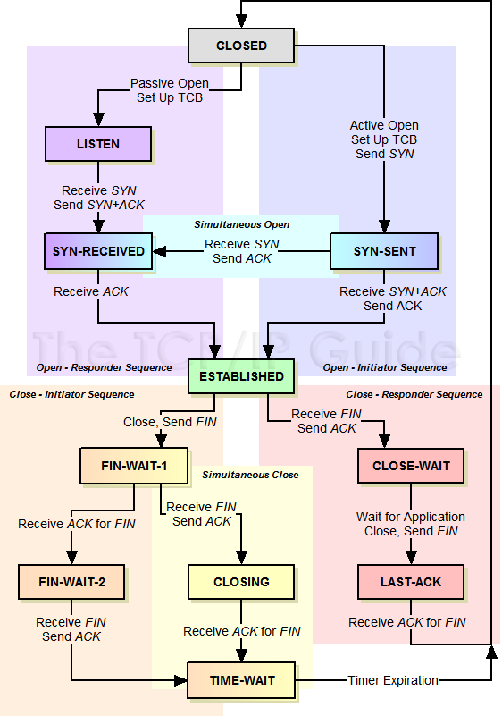

# 关于TCP的简单介绍

------

## 1. TCP的三次握手/四次挥手

TCP进行握手初始化一个连接的目标是--分配资源并且初始化序列号(通知peer对端我的初始序列号是多少), 握手过程可以简化为下面的四次交互:
> * client端首先发送一个SYN包告诉Server端其初始序列号是X;
> * Server端收到SYN包后回复给client一个ACK确认包, 告诉client已收到;
> * Server端告诉client端自己的初始序列号, 发送一个SYN包告诉client其初始序列号是Y;
> * Client回复Server一个ACK包, 表示已收到.

>   为分辨Server发出的SYN包是连接包还是响应包, 并且节约一次发送, 将Server的ACK和SYN合并, 成为一个SYN ACK包.

特别的, 在当Peer两端同时发起SYN来建立连接的时候, 会有四次握手:

TCP进行断开连接的目标是--回收资源, 终止数据传输. 
由于TCP是全双工的，需要Peer两端分别各自拆除自己通向Peer对端的方向的通信信道, 因此需要四次挥手来分别拆除通信信道.
> * Client发送一个FIN包告诉Server发送完成;
> * Server答复ACK表示收到;
> * Server继续传输, 直至也发送完成, 然后发送一个FIN包告诉Client它也发送完成;
> * Client答复ACK表示收到.

## 2. TCP连接的初始化序列号能否固定

如果初始化序列号(缩写为ISN: Inital Sequence Number)可以固定: 假设ISN固定是1, Client和Server建立好一条TCP连接后, Client连续给Server发了10个包, 这10个包可能由于某种机制被链路上的路由器缓存, 在这时碰巧Client挂掉, 然后重新用原来的端口号重连了Server, 继续给Server发包, 当发到第5个时, 之前路由器缓存的10个包又恰好发送给了Server, Server就会给Client回复确认号是10, Client发现自己发送了5, 但是收到了10, 就全部混乱了.
因此, 在RFC793中, 建议ISN绑定一个"时钟", 这个时钟每4微秒对ISN做+1操作, 直到超过2^32就又回到0, 这样就可以保证4小时内没有ISN的重复.  几乎可以避免新的ISN和旧的ISN的冲突.

## 3. 初始化连接的SYN超时问题

如果Client发送SYN包给Server后挂了, Server回给Client的SYN-ACK一直没收到Client的ACK确认, 这时连接既没建立, 也没失败就会一直占用Server的SYN连接队列中的一个位置, 大量这样的连接就会将Server的SYN连接队列耗尽, 让正常的连接无法得到处理.
因此, Linux下的Server默认会5次重发SYN-ACK包, 重试的间隔时间从1s开始, 下一次的重试间隔时间是前一次的两倍, 5次的重试时间间隔为1s, 2s, 4s, 8s, 16s, 总共31s, 第5次发出后还要等32s确认第5次也超时, 共计63s, Server这边就会将这个连接断开.
由于Server的SYN超时需要63秒, 因此可能有攻击者短时间向Server发送大量SYN包, 耗尽SYN队列(SYN Flooding). (可以通过tcp_syncookies, tcp_synack_retries, tcp_max_syn_backlog, tcp_abort_on_overflow等参数应对)

## 4. TCP的Peer两端同时断开连接
如果TCP的Peer端在收到对端的FIN包前发出了FIN包, 那么该Peer的状态就变成了FIN_WAIT1, Peer在FIN_WAIT1状态下收到对端Peer对自己FIN包的ACK包的话, 那么Peer状态就变成FIN_WAIT2, Peer在FIN_WAIT2下收到对端Peer的FIN包, 在确认已经收到了对端Peer全部的Data数据包后, 就响应一个ACK给对端Peer, 然后自己进入TIME_WAIT. 
但是如果Peer在FIN_WAIT1状态下首先收到对端Peer的FIN包的话, 那么该Peer就会确认已经收到了对端Peer全部的Data, 然后响应一个ACK给对端Peer, 并且自己进入CLOSING, Peer在CLOSING下收到对自己的FIN包的ACK包的话, 就会进入TIME_WAIT. 因此, 当TCP的Peer两端同时发起FIN包进行断开连接, 那么两端Peer可能出现完全一样的状态转移 FIN_WAIT1——>CLOSING——->TIME_WAIT, 也即Client和Server最终同时进入TIME_WAIT状态.

## 5. 四次挥手能否变成三次挥手

四次挥手的基础是TCP是全双工通信, Client在自己已经不会在有新的数据要发送给Server后发送FIN信号告知Server, 并终止Client到对端Server的数据传输. 但这时对端Server可以继续往Client发送数据包. 因此, 两端数据传输的终止在时序上是独立并且可能会相隔比较长的时间, 需要2 + 2 = 4 次挥手来完全终止这个连接. 
但是, 如果Server在收到Client的FIN包后，也没数据需要发送给Client了, 就会将对Client的ACK包和自己的FIN包就合并成一个包发送, 这时的四次挥手就变成三次了.

## 6. TIME_WAIT状态

### 进入TIME_WAIT

Peer两端先发出了FIN包的一方, 被认为是TCP主动关闭连接的一方. 回顾一下四次挥手, 主动关闭方发出FIN后, 被动关闭方发送对这个FIN的ACK, 并发送自己的FIN, 主动关闭方收到被动关闭方的FIN, 发送ACK, 被动关闭方等待主动关闭方的ACK.
如果主动关闭方的ACK发完就走, 不进入TIME_WAIT, 在这种情况下ACK丢失, 导致被动关闭方一直在等, 就一直不能关闭连接, 导致被动关闭方重发FIN, 但主动关闭方已经不存在, 没有对被动关闭方的FIN的ACK, 被动关闭方将永远无法关闭连接. 因此主动关闭方需要进入TIME_WAIT, 以便能够在ACK丢失时候能够重发对被动关闭方的FIN的ACK.
因此, TCP主动关闭连接的一方, 一定需要进入TIME_WAIT. 如果Peer两端都是主动关闭, 两边都会进入TIME_WAIT.

### 如果没有TIME_WAIT

在上述的情况中提到的, 主动关闭方已经离开, 但收到了被动关闭方的FIN, 协议栈会认为在没有建立连接的条件下突然收到了FIN, 于是回复RST包给被动关闭方. ("connetion reset by peer" or "Broken pipe")
或者导致已经关闭连接的残余数据包干扰正常的数据包. ("a lost duplicate packet or a wandering duplicate packet")

### TIME_WAIT带来的问题

一个连接进入TIME_WAIT状态后需要等待2*MSL(一般是1到4分钟)那么长的时间才能断开连接释放连接占用的资源.
> * 服务器短时间内关闭了大量的Client连接, 造成大量的TIME_WAIT连接, 消耗资源;
> * 客户端短时间内发起大量的短连接会消耗过多端口, 导致无法发起后续连接.
>   (本机连本机如果是巨量短连接就选用UNIX sock吧--虽然是select的)

### TIME_WAIT的回收和重用

> * tcp_timestamps
> * tcp_tw_recycle
>   Enable fast recycling TIME-WAIT sockets.
> * tcp_tw_reuse
>   Allow to reuse TIME-WAIT sockets for new connections when it is safe from protocol viewpoint.

理论上, 同时打开timestamps和recycle选项就可以实现Linux下TIME_WAIT的快速回收, 然而, 因为Linux下快速回收的时间为3.5 * RTO(Retransmission Timeout), 一个RTO时间为200ms至120s, 开启快速回收可能带来上述"如果没有TIME_WAIT"的风险. 为避免快速回收产生异常, 快速回收被设计出了一个机制 -- 当满足以下3点时, 新连接会被拒绝:

> * 来自同一个对端peer的TCP包携带了时间戳;
> * 之前同一台peer机器(仅仅识别IP地址，因为连接被快速释放了，没了端口信息)的某个TCP数据在MSL秒之内到过本Server;
> * peer机器新连接的时间戳小于peer机器上次TCP到来时的时间戳，且差值大于重放窗口戳(TCP_PAWS_WINDOW).

这样就回避掉了快速回收中主动关闭方突然收到莫名其妙的FIN而回复RST的问题. 这个做法本来是可行的, 然而在NAT下, 所有后端机器都被当成同一台, 而这些后端peer的时间戳很可能不完全一致, 当时间戳快的Client建立的连接被Server关闭, 并进入了快速回收, 时间戳慢的Client发起了连接, 就会导致这个连接被Server拒绝.

因此, 在NAT后, 要谨慎使用recycle, 改为使用reuse, 其机制是, 下面两个条件任意满足一点, 即可使得TIME_WAIT的socket能被新到来的SYN连接复用:

> * 新连接SYN告知的初始序列号比TIME_WAIT老连接的末序列号大(确保序列号比之前的要新);
> * 如果开启了tcp_timestamps，并且新到来的连接的时间戳比老连接的时间戳大(确保时间比之前的要新).
>   (要同时开启tcp_tw_reuse选项和tcp_timestamps选项才可以开启TIME_WAIT重用)

tcp_tw_reuse对Server端来说并没解决大量TIME_WAIT造成的资源消耗的问题, 因为不管TIME_WAIT连接是否被重用，它依旧占用着系统资源. 但它可以使得Server不会被一直拒绝接入.

### TIME_WAIT的清理
> * 修改tcp_max_tw_buckets
> * 利用RST包从外部清掉TIME_WAIT链接(提前终止TIME_WAIT, RFC1337建议不要这样做)

## 7. TCP的延迟确认机制

按照TCP协议, 确认机制是累积的, 也即确认号X的确认指示的是所有X之前但不包括X的数据已经收到了. 
确认号(ACK)本身就是不含数据的分段, 因此大量的确认号消耗了大量的带宽, 虽然大多数情况下ACK还是可以和数据一起捎带传输的, 但是如果没有捎带传输, 那么就只能单独回来一个ACK, 如果这样的分段太多,  网络的利用率就会下降. 
为缓解这个问题, RFC建议了一种延迟的ACK, 即ACK在收到数据后并不马上回复, 而是延迟一段可以接受的时间, 看能不能和接收方要发给发送方的数据一起回去, 因为TCP协议头中总是包含确认号的, 如果能将数据一起捎带回去, 网络利用率就提高了. 延迟ACK就算没有数据捎带, 那么如果收到了按顺序的两个包, 只要对第二包做确认即可,  这样也能省去一个ACK消耗.
由于TCP协议不对ACK进行ACK, RFC建议最多等待2个包的积累确认, 这样能够及时通知对端peer接收的情况. Linux实现中有延迟ACK和快速ACK, 并根据当前的包的收发情况来在这两种ACK中切换. 延迟ACK通过减少发送的分段从而节省带宽, 快速ACK能及时通知发送方丢包, 避免滑动窗口停等, 提升吞吐率.

## 8. TCP的重传机制以及重传的超时计算

### 超时的计算

TCP交互过程中, 如果发送的包一直没收到ACK确认, 等太长时间, 数据包都丢了很久了才重发, 没有效率, 性能差; 等太短时间, 可能ACK还在路上快到了, 这时候却重传了, 造成浪费, 同时过多的重传会造成网络拥塞, 进一步加剧数据的丢失.
所以, 需要根据数据包从发出去到回来的时间RTT(Round Trip Time)来设置RTO(Retransmission TimeOut).

RFC793中定义的RTO算法:
> * 首先采样计算RTT值;
> * 计算平滑的RTT, Smoothed Round Trip Time (SRTT). 
    SRTT = ( ALPHA * SRTT ) + (( 1-ALPHA ) * RTT )
> * RTO = min[UBOUND,max[LBOUND,(BETA*SRTT)]]
    UBOUND是RTO值的上限, LBOUND是RTO值的下限, 可自定义.
    
这个算法存在一个问题, 即在计算RTT样本的时候, 是用第一次发数据的时间和ACK回来的时间做RTT样本值(RTT过长), 还是用重传的时间和ACK回来的时间做RTT样本值(RTT过短)? 如图所示:

因此, 在RFC6289中改进了这个算法: 除了考虑每两次测量值的偏差之外, 其变化率也应该考虑在内. 如果变化率过大, 则通过以变化率为自变量的函数为主计算RTT(如果陡然增大, 则取值为比较大的正数, 如果陡然减小, 则取值为比较小的负数, 然后和平均值加权求和). 反之如果变化率很小, 则取测量平均值:
> * 计算平滑RTT: 
    SRTT = SRTT + α (RTT – SRTT)
> * 计算平滑RTT和真实的差距(加权移动平均): 
    DevRTT = (1-β) * DevRTT + β * (|RTT-SRTT|)
> * 然后我就看不懂了...
    RTO= µ * SRTT + ∂ * DevRTT
    在Linux下, α = 0.125, β = 0.25, μ = 1, ∂ = 4
    
确定RTO怎么计算后, 就需要设置一个计时器, 这个计时器器在RFC2988中的规则是:
> * 每一次一个包含数据的包被发送(包括重发), 如果还没开启重传定时器, 则开启它, 使得它在RTO秒之后超时(按照当前的RTO值);
> * 当接收到一个ACK确认一个新的数据, 如果所有的发出数据都被确认了, 关闭重传定时器;
> * 当接收到一个ACK确认一个新的数据, 还有未被确认的数据在传输, 重新启动重传定时器，使得它在RTO秒之后超时(按照当前的RTO值);
> * 当重传定时器超时后, 依次做下列3件事情:
    重传最早的尚未被TCP接收方ACK的数据包;
    重新设置RTO 为 RTO * 2 ("还原定时器"), 但是新RTO不应该超过RTO的上限(最少为60s)
    重启重传定时器.

### 重传的机制
按需重传, 最大程度节省带宽, 但是需要等待超时, 会比较慢.
按顺序把丢失后的全部重传, 会比较快, 但重传不必要的包, 浪费带宽.

TCP使用了快速重传(Fast Retransmit)的方法, 若连续收到3次相同确认号的ACK, 则进行重传. (这个算法基于一个假设, 即连续收到3个相同的ACK, 说明之前的网络异常, 且现在恢复了, 可以重传)
RFC2018中提出了一个选择确认机制SACK(Selective Acknowledgment), 依赖接收端的接收情况进行反馈, 并进行重传.

在SACK思想(接收端反馈信息)的基础上, RFC2883提出了扩展的SACK, 即D-SACK, 使第一块SACK的数据描述重复接收的不连续数据块的序列号, 后续的SACK数据描述正常接收的不连续数据. 发送方在获取第一个SACK之后, 就能根据其内容来调整重传策略.

> * 发送端重传包, 若能收到D-SACK, 则是发包丢失了, 否贼是接收端的ACK丢失;
> * 收到较多D-SACK, 可能是发送端RTO过小, 导致过早重传;
> * 如果发送端并未重传, 却收到了D-SACK, 说明发送端的数据包被复制了;
> * 如果先发的包却后到, 说明有一些包在中途被delay.

## 9. TCP的流量控制

TCP的窗口(window)是一个16bit位字段, 它代表的是窗口的字节容量, 也就是TCP的标准窗口最大为2^16-1=65535个字节.
在TCP的选项字段中还包含了一个TCP窗口扩大因子, option-kind为3, option-length为3个字节, option-data取值范围0-14. 窗口扩大因子用来扩大TCP窗口, 可把原来16bit的窗口, 扩大为31bit.
窗口用于接收端告诉发送端自己还有多少缓冲区可以接收数据. 发送端根据接收端的处理能力来发送数据, 以避免导致接收端无法响应. 也即是发送端根据接收端通知的窗口大小来调整发送速率, 以实现端到端的流量控制.

### 窗口通告

按照接收方的窗口通告, 发送方需要维护一个一样大小的发送窗口, 在窗口内的可以发, 窗口外的不可以发, 窗口在发送序列上不断后移, 这就是TCP中的滑动窗口.

> 1. 已经发送并得到接收端ACK的;
> 2. 已经发送但还未收到接收端ACK的; 
> 3. 未发送但允许发送的(接收方还有空间);
> 4. 未发送且不允许发送(接收方没空间了).

窗口滑动情况--收到36的ACK后，窗口向后滑动5个byte:

### 接收端的窗口大小为0的情况(zero window)

当接收端通知一个zero窗口时, 发送端的发送窗口也会变成0, 也就是不发数据了. 一个发送端随接收端窗口大小调整的示意如图:

这时, TCP使用ZWP(Zero Window Probe)技术, 当发送端窗口变成0后, 会发ZWP包给接收方, 以探测接收方的窗口大小, 并重试3次, 每次30~60秒(根据不同实现而不一样), 如果3次之后窗口大小还是0, 则发RST断掉这个连接.
(这可能导致DDoS攻击, 当攻击者和Server建立连接后, 就向Server通告0窗口, 导致Server等待ZWP, 大量这样的请求会导致Server资源耗尽)

### 如何避免发送大量小包

如果两端peer的处理速度有限, 而窗口填满很快, 例如以下两种情况:
1. 接收端一直通知了小窗口;
2. 发送端一直发送小包;
会导致TCP的SWS(Silly Window Syndrome), "糊涂窗口综合症".

对应的解决方法是:
1. 接收端不通知小窗口;
    设置一个最小窗口值, 如果收到的数据导致windows size小于这个值, 则ACK一个0窗口, 阻止发送端发送, 待接收端处理一些数据后, windows size大于等于MSS, 再通告非0窗口;
2. 发送端积累一段时间数据再发送;
    Nagle's algorithm:
        如果包长度达到 MSS, 则允许发送;
        如果该包含有FIN, 则允许发送;
        设置了TCP_NODELAY选项, 则允许发送;
        设置TCP_CORK选项时, 若所有发出去的小数据包(包长度小于MSS)均被确认, 则允许发送;
        上述条件都未满足, 但发生了超时(200ms), 则立即发送;
    (并不禁止发送小的数据包(超时时间内)，而是避免发送大量小的数据包, TCP会尽力把小数据包拼接成一个大的数据包(一个MTU)再发送, 这样可以提高网络利用率, 但是代价是增加了延时.)

特别说明, Nagle算法和延迟确认(Delayed Acknoledgement)一起使用时, 可能会引发一个40ms的延时问题, 例如:
客户端在请求下载HTTP server(例如nginx)中的一个小文件, 一般情况下, HTTP server会先发送HTTP响应头, 再发送HTTP响应体. 若header和body都较小, 根据Nagle算法, 在接收方收到第一个小包的ACK或等待200ms超时后, 发送方才能再发小包, 所以HTTP Server发出一个小header后, 无法发出body. 客户端收到header后, 由于是小包, 就开启延迟确认, 等待后续的小包之后才会发送ACK. 这样的结果就是HTTP Server等待Client对response header的ACK, 而Client又要等待HTTP Server发出后续小包才会给出ACK, 形成"锁"的状态, 直到Client这边到达40ms的超时之后, 发出ACK, 然后才继续由Server发出body. 
(在nginx中, 可以使用tcp_nopush on启用TCP_CORK, 使用tcp_nodelay on禁用Nagle以避免这种情况.)

## 10. TCP的拥塞控制

网络上的拥塞, 本质上就是大家都想独享整个网络资源. 对于TCP而言, 端到端的流量控制必然会导致网络拥堵. 这是因为TCP只看到对端的接收空间的大小, 而无法知道链路上的容量, 如果两端的处理能力都很强, 那么就会以很大的速率发包, 于是链路很快出现拥堵, 进而引起大量的丢包, 而丢包又引发发送端的重传风暴, 进一步加剧链路的拥塞.
因此, 需要拥塞控制以保证: 1. 传输公平, 2. 拥塞之后能够恢复.

RFC5681中给出了Reno算法, 其基础是冗余ACK(duplicate acknowledgment):

> * 接收ACK的那端已经发出了一些还没被ACK的数据包;
> * 该ACK没有携带data;
> * 该ACK的SYN和FIN位都是off的，也就是既不是SYN包的ACK也不是FIN包的ACK;
> * 该ACK的确认号等于接收ACK那端已经收到的ACK的最大确认号;
> * 该ACK通知的窗口等接收该ACK的那端上一个收到的ACK的窗口.

### Reno算法

TCP依赖于一个拥塞窗口(cwnd, Congestion Window)和一个接收端通告的接收窗口(rwnd, Receive Window)用于流量控制, 加上拥塞控制后, 发送端真正的发送窗口=min(rwnd, cwnd), 在TCP中, cwnd以字节作为单位.
下面的说明中, 假设TCP每次传输大小都是一个MSS*最大分段大小(Maximum Segment Size)*. 也即是cwnd增加1, 表示字节数增加1个MSS. 

#### 慢热启动算法 - Slow Start

慢启动并不慢, 只是起点较低:

> * 连接建好的开始先初始化cwnd = N, 表明可以传N个MSS大小的数据;
> * 每当收到一个ACK，++cwnd; 呈线性上升;
> * 每当过了一个RTT，cwnd = cwnd * 2; 呈指数上升;
> * 当cwnd达到慢启动门限ssthresh(slow start threshold)时, 进入"拥塞避免算法 - Congestion Avoidance"
>   根据RFC5681, 如果MSS > 2190 bytes，则N = 2; 如果2190 bytes >= MSS >= 1095 bytes, 则N = 3; 如果MSS < 1095 bytes, 则N = 4; 一般Linux中是1460字节;
>   根据google的论文"An Argument for Increasing TCP' s Initial Congestion Window", Linux3.0之后的版本将cwnd初始化成10个MSS.

#### 拥塞避免算法 - Congestion Avoidance

如果TCP的重传计时器RTO超时且还没有得到数据确认, TCP就会重传, 且认为出现拥塞的可能性就很大, 会进行以下策略:

> * 每收到一个ACK, 调整cwnd为(cwnd + 1/cwnd) * MSS个字节;
> * 每经过一个RTT的时长, cwnd增加1个MSS大小;
> * 出现RTO超时, 重传数据包. 这种情况下, TCP就认为出现拥塞的可能性就很大:
>   1. 调整门限ssthresh的值为当前cwnd值的1/2;
>   2. reset自己的cwnd值为1;
>   3. 重新进入慢启动过程.

#### 快速重传 - Fast Retransimit

除了RTO超时外, TCP还在一种情况下进行重传: 连续收到3个相同的ACK(duplicate acknowledgment), 这种情况下, TCP进行以下策略:

> * sthresh = cwnd / 2 (减半的恢复策略使得所有连接变得"公平", 一旦某个连接丢包, 立即减半回退, 给其他的新建连接迅速腾出足够的带宽空间);
> * cwnd = ssthresh;
> * 重新进入拥塞避免阶段.

#### 快速恢复算法 - Fast Recovery

快速恢复是在快速重传算法基础上添加, 和快速重传一起使用. 其思想是"数据包守恒"原则, 即带宽不变的情况下, 在网络同一时刻能容纳数据包数量是恒定的.

> * ssthresh = cwnd / 2;
> * cwnd = ssthresh + 3 (加3的原因是收到3个重复的ACK就表明有3个"老"的数据包离开了网络, 只要有1个数据包离开了网络, cwnd就加1);
> * 如果再收到duplicated acks，cwnd = cwnd + 1;
> * 当收到非duplicated acks的新数据包ACK时，把cwnd设置为第一步中的ssthresh的值(因为该ACK确认了新的数据, 说明从重复ACK时的数据都已收到, 该恢复过程已经结束, 可以回到恢复之前的状态).

### New Reno

Reno算法和拥塞控制的基础是假设3个冗余的ACK只代表丢失1个包, 但是3个冗余ACK也很有可能是丢失了很多个包, 但快速重传只重传了一个, 其他丢失的包仍然要等到RTO超时.
为解决这个问题, 提出New Reno算法:

> * 发送端收到3个冗余ACK后, 重传冗余ACK指示可能丢失的那个包segment1, 如果segment1的ACK通告接收端已经收到发送端的全部已经发出的数据的话, 那么就是只丢失一个包, 如果没有，则是多个包丢失;
> * 发送端根据segment1的ACK判断出有多个包丢失, 则发送端继续重传窗口内未被ACK的第一个包, 直到滑动窗口内发出去的包全被ACK了, 才真正退出Fast Recovery阶段.

*所以从这里也能看出来为什么多个连接的下载软件(比如迅雷)能够很快, 因为TCP在拥塞控制策略的影响下, 是会达成"每个连接平分带宽"的, 假设两个用户一起使用一个带宽, 一个用户是1个TCP连接, 另一个用户是99个TCP连接, 那他们分到的带宽就分别是1%和99%...*

## 11. TCP的backlog

Linux的协议栈维护的两个TCP连接队列:

> * SYN半连接队列: Server端收到Client的SYN包并回复SYN+ACK包后, 该连接的信息就会被移到一个队列, 这个队列就是SYN半连接队列(此时TCP连接处于非同步状态);
> * accept连接队列: Server端收到SYN+ACK包的ACK包后, 就会将连接信息从SYN半连接队列移到另外一个队列, 这个队列就是accept连接队列(这个时候TCP连接已经建立, 三次握手完成了)

在Linux kernel 2.2之前, backlog指的是上述两个队列之和, 在Linux kernel 2.2之后, backlog指accept连接队列的大小.

在kernel 2.2后, 两个队列分别由以下参数控制:

> * SYN半连接队列 - /proc/sys/net/ipv4/tcp_max_syn_backlog 
>   若这个队列满了, Server会丢弃新来的SYN包, 而Client端在多次重发SYN包得不到响应而返回(connection time out)错误. 但是, 当Server端开启了syncookies时, SYN半连接队列就没有逻辑上的最大值了, 并且/proc/sys/net/ipv4/tcp_max_syn_backlog设置的值也会被忽略.
> * accept连接队列 - /proc/sys/net/core/somaxconn
>   若这个队列满了, 协议栈的行为根据(/proc/sys/net/ipv4/tcp_abort_on_overflow)内核参数而定. 如果tcp_abort_on_overflow = 1, server在收到SYN_ACK的ACK包后, 协议栈会丢弃该连接并回复RST包给对端, 这时Client会出现(connection reset by peer)错误. 如果tcp_abort_on_overflow = 0, server在收到SYN_ACK的ACK包后, 会直接丢弃该ACK包. 这时Client认为连接已建立, 会一直等待Server的数据, 直到超时出现read timeout错误.

